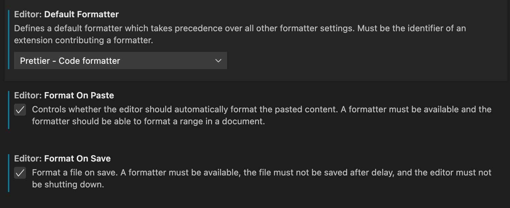

# SendIt Website

This is the repository for the website of https://sendit.finance

## Installation

Simply clone the repository and run `npm install` and you are ready to run
the Sendit stack.

## Local Development

Run `npm run dev` to launch a local preview server. The dev server will automatically open your favourite browser.

To get debug logs in your browser console, do one of two things:

1. append the following querystring to your url `?debug=1`
2. in the console, set `localStorage.debug = 'sendit*'`

## Dev Setup

We are using `prettier` for automatic code formatting. Please make sure your IDE has prettier enabled. The formatting instructions are stored in `.prettierrc`.
In VSCode install the [prettier](https://github.com/prettier/prettier-vscode) extension and then enable it in the settings:

Then set up prettier to [auto-format your code on-save](https://scottsauber.com/2017/06/10/prettier-format-on-save-never-worry-about-formatting-javascript-again/)

## Project Outline

Sendit.finance is currently running as a static webpage. We're using Next.js to
generate the static assets. For components we are using React and a simplified
Redux state module called `redux-zero`. The project was deployed and hosted via
AWS. While the AWS automation code remains in this repo, the sensitive
information has been removed.

### Route Definition

You can find all routes in `./pages`. To add a new route simply add a
new folder and place a new file called `index.js`. You can review other
routes for reference content.
